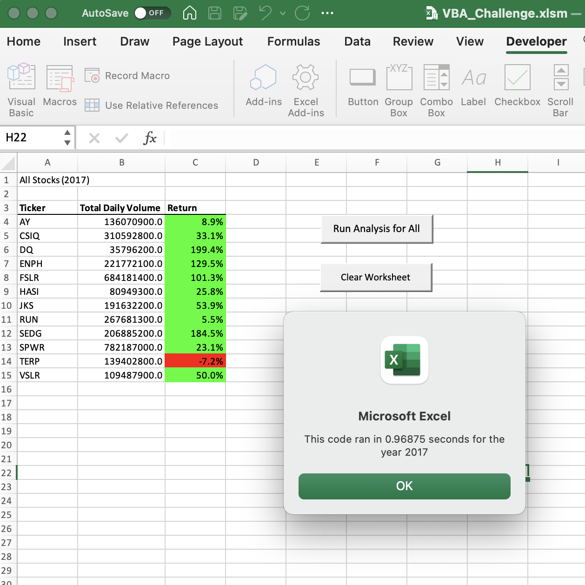
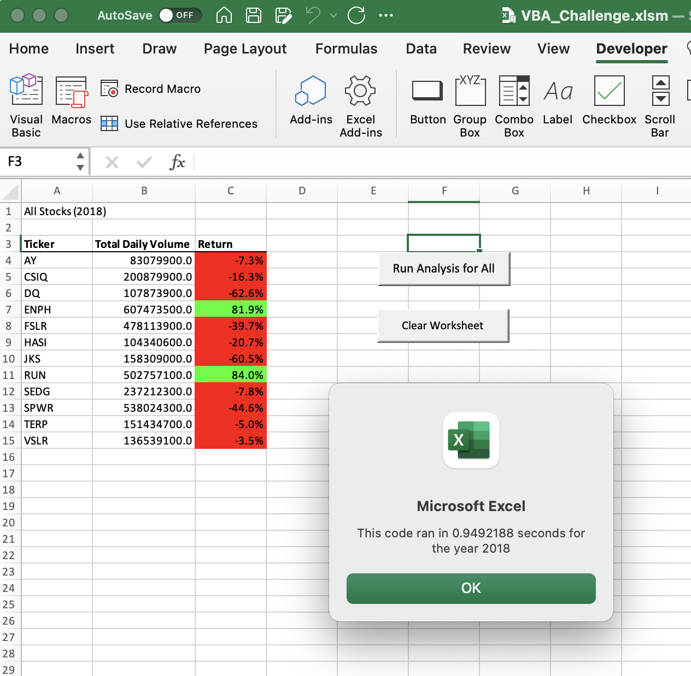
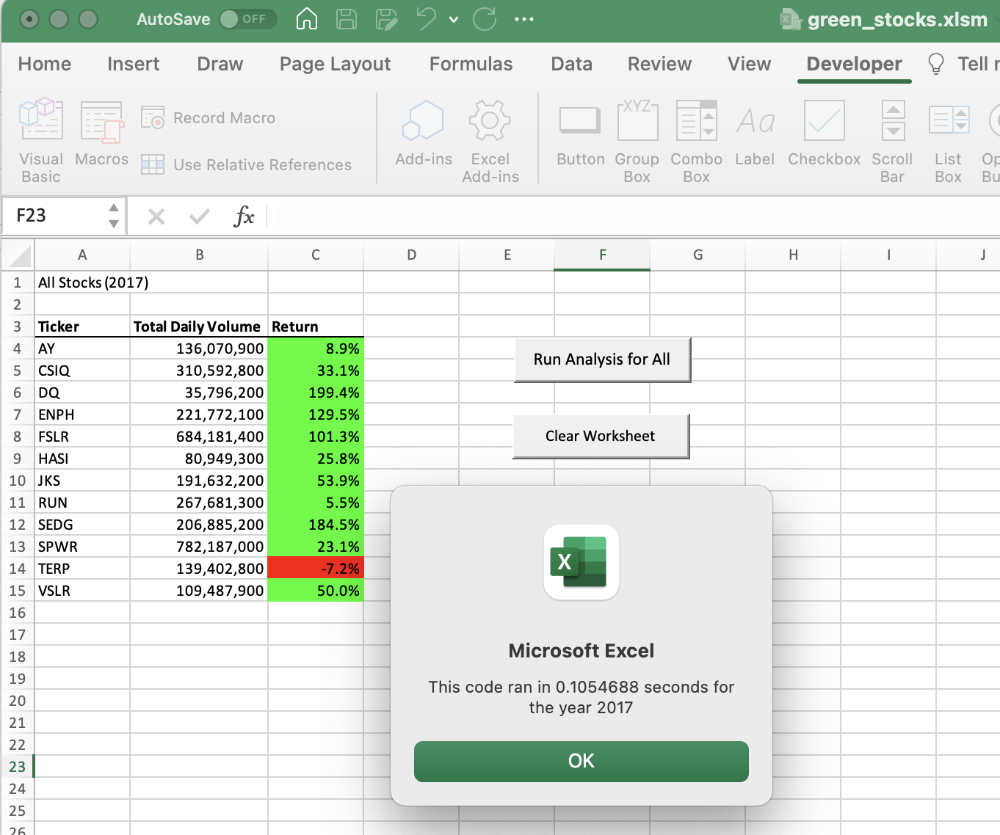
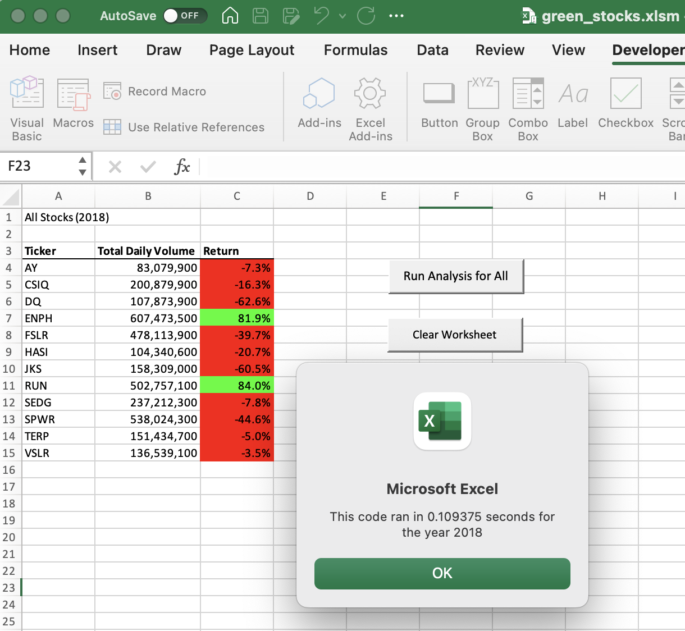

# VBA_Challenge-Module2

To anazlyze the stocks from using green stocks

## Overview of project and purpose
In this project the workbook needs to be prepare and analyze for steve. The research is so expand dataset to include entire stock market over last few years but spefically lookin on 2017 and 2018. So the challenge is using the VBA knowlegde from modules and apply to this project. We musts create loop through all data one time in order to collect the same information that I did in the module. To determine if refactoring my code successfully made VBA script run faster. Also include buttone one for Run Analysis and clear. Then I create message with button to say which year to analyze. 

1. Create VBA macros that can format read and change cell values
2. Learn how to use for loops and conditionals
3. learn how to format and other coding skills
4. Use run buttons and timer, arrays, if-then conditional statements
5. The main purpose is to analyze code for Steve and refactor the module 2 solution code

## Analysis
What we can see from exceuting both 2017 and 2018. The 2017 ran 0.96875s while 2018 ran 0.9492188s. Just 0.0195312 seconds difference.

The advantage of refactoring code is to loop data each one of the stocks in order to collect same info. So after making refactoring code it can be successfully make VBA script run faster and smooth as possible. Its more efficient by taking few steps. Also improve logic of the code so that future programmer or Data Scientist can read properly.

## Challenges and Difficulties encountered
The challenges I took even futhure was i use the VBA_Challenge.vbs then paste it into Green Stocks to see any thing difference in timeing. After implementing Refactoring. It seems timing is even faster then the VBA challenge. 

## Summary: Advantages and disvantgages. 
The purpose of using Refactoring the code is to improved the organizingm readability and reduce run time. It helps to analyzes any work for instace stocks that can run analaysis in short amount time. But the disadvantage of doing refactoring is the long process of solving problems to approach the solution according to client's desire of work. Requiring to test altnertive steps and testing to see how it plays out in the script. While working on refactor script we may encounter some bugs to tight deadlines which we have to choose either fix refactoring or develop new script. 
